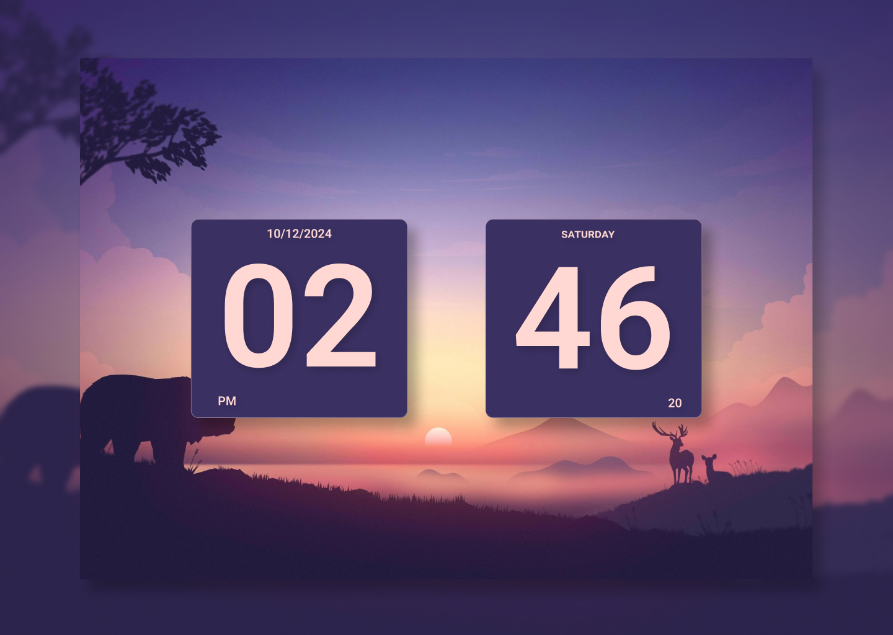

# Clock Project ⏰  

A simple and elegant clock built with **HTML**, **CSS**, and **JavaScript**, designed with **Figma**. This project demonstrates responsive design, creative UI/UX skills, and basic JavaScript functionalities to build an interactive clock.

---

## Features 🌟  

- Displays current time ,date and day.  
- **Responsive design** for various screen sizes.  
- Smooth and visually appealing UI/UX inspired by the Figma design.  
- Real-time updates powered by JavaScript.  

---

## Preview 🚀  

## Technologies Used 🛠️  

- **HTML**: For structure.  
- **CSS**: For styling and responsiveness.  
- **JavaScript**: For real-time clock functionality.  
- **Figma**: For UI/UX design.  

---

## Usage 📖
- Open the webpage to view the real-time clock.
- Resize the browser window to see the responsive design in action.

## Figma Design 🎨
The UI/UX of the clock was designed using Figma. [Check out the design here](https://www.figma.com/design/DtUeFuzUvhjMziMWrGCUr4/flip-flop-clock?fuid=1331957299204890869).

## Contributing 🤝
Contributions are welcome! Please feel free to submit a pull request or open an issue.

## Author 👨‍💻
- **Goutam khanna**
  - [live web-site](https://dark1arrow.github.io/clock/)
  - [LinkedIn](https://www.linkedin.com/in/gouatm-khanna-61ba63262?utm_source=share&utm_campaign=share_via&utm_content=profile&utm_medium=android_app)

